## &nbsp; {.svg-slide background-color="#1A2A66" data-menu-title="표지"}

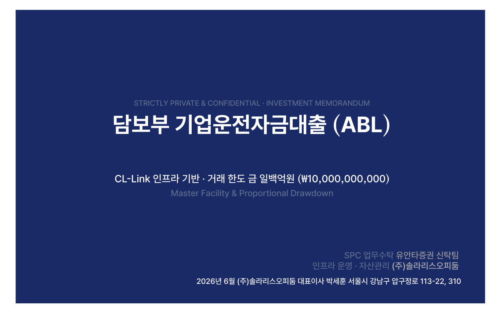{.slide-art}

<div class="confidential">㈜솔라리스오피둠 · STRICTLY PRIVATE &amp; CONFIDENTIAL</div>

---

## &nbsp; {.svg-slide data-menu-title="목차"}

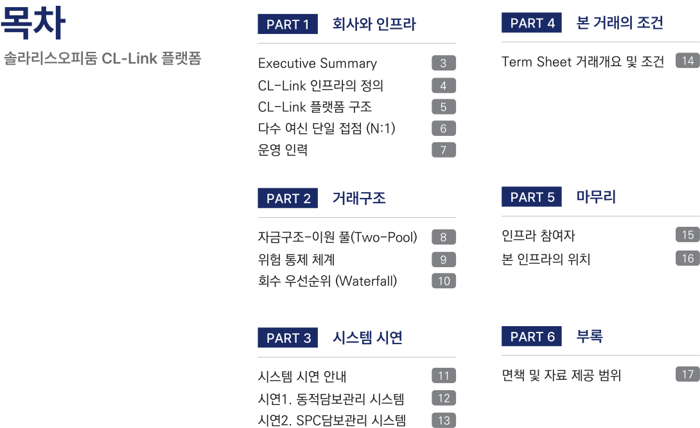{.slide-art}

<div class="confidential">㈜솔라리스오피둠 · STRICTLY PRIVATE &amp; CONFIDENTIAL</div>

---

## &nbsp; {.svg-slide data-menu-title="Executive Summary"}

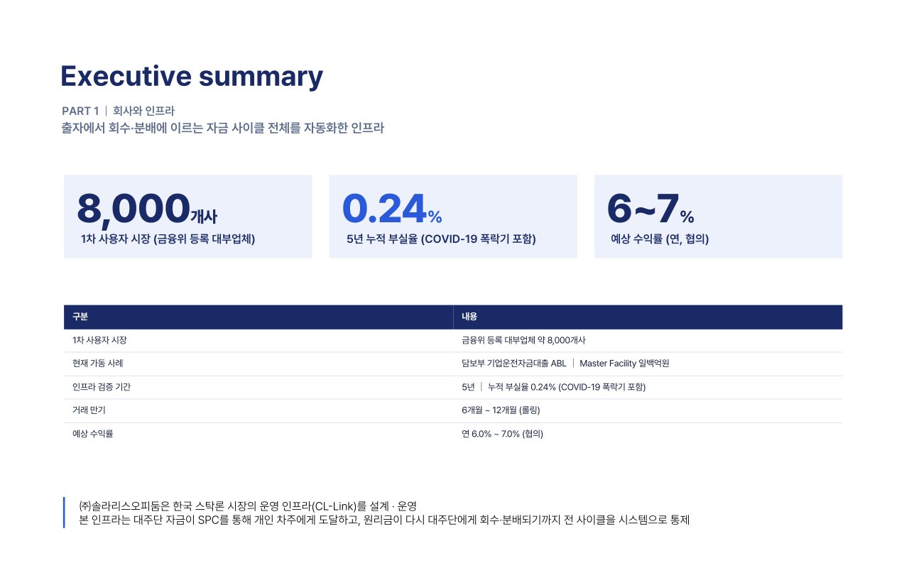{.slide-art}

<div class="confidential">㈜솔라리스오피둠 · STRICTLY PRIVATE &amp; CONFIDENTIAL</div>

---

## &nbsp; {.svg-slide data-menu-title="인프라 정의"}

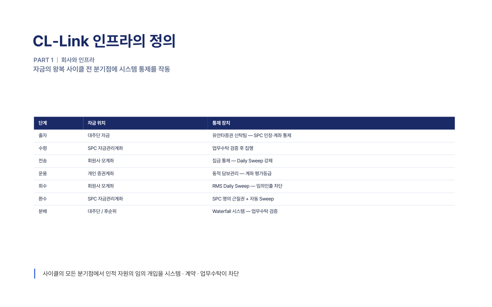{.slide-art}

<div class="confidential">㈜솔라리스오피둠 · STRICTLY PRIVATE &amp; CONFIDENTIAL</div>

---

## CL-Link 플랫폼 구조 {.diagram-slide data-menu-title="CL-Link 구조"}

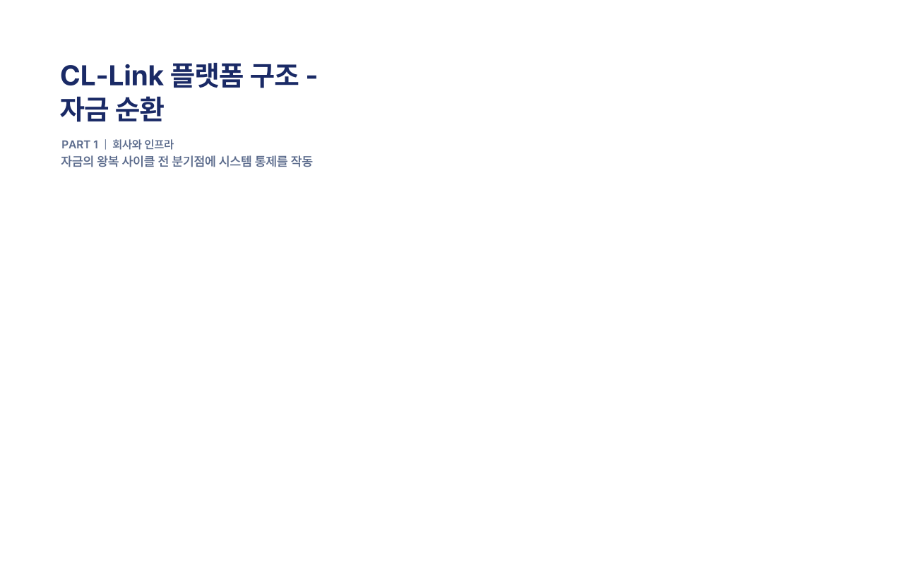{.slide-art-text}

<div class="diagram-stage">

```{=html}
<svg class="s6-svg" viewBox="0 0 1280 770" xmlns="http://www.w3.org/2000/svg" role="img" aria-label="CL-Link 플랫폼 자금 순환 구조도">
  <style>
    .s6-navy{fill:#1A2A66;filter:url(#s6sh)}
    .s6-brand{fill:#2A5ADA;filter:url(#s6sh)}
    .s6-region{fill:#EDF1FC}
    .s6-clabel{fill:#6B7AA0;font-size:18px;font-weight:600;letter-spacing:1px}
    .s6-title-inv{fill:#fff;font-size:17px;font-weight:700;letter-spacing:0.08em}
    .s6-sub-inv{fill:#fff;font-size:13px;font-weight:400}
    .s6-flow{fill:none;stroke-linecap:butt;stroke-dasharray:0 100;opacity:0}
    .s6-tip{opacity:0}
    .s6g0{animation:s6g0 8.0s linear infinite}.s6pt0{animation:s6t0 8.0s linear infinite}.s6ph0{animation:s6h0 8.0s linear infinite}.s6g1{animation:s6g1 8.0s linear infinite}.s6pt1{animation:s6t1 8.0s linear infinite}.s6ph1{animation:s6h1 8.0s linear infinite}.s6g2{animation:s6g2 8.0s linear infinite}.s6pt2{animation:s6t2 8.0s linear infinite}.s6ph2{animation:s6h2 8.0s linear infinite}.s6g3{animation:s6g3 8.0s linear infinite}.s6pt3{animation:s6t3 8.0s linear infinite}.s6ph3{animation:s6h3 8.0s linear infinite}.s6g4{animation:s6g4 8.0s linear infinite}.s6pt4{animation:s6t4 8.0s linear infinite}.s6ph4{animation:s6h4 8.0s linear infinite}.s6g5{animation:s6g5 8.0s linear infinite}.s6pt5{animation:s6t5 8.0s linear infinite}.s6ph5{animation:s6h5 8.0s linear infinite}.s6g6{animation:s6g6 8.0s linear infinite}.s6pt6{animation:s6t6 8.0s linear infinite}.s6ph6{animation:s6h6 8.0s linear infinite}
    @keyframes s6g0{0%{stroke-dasharray:0 100;opacity:1}7.50%{stroke-dasharray:100 100;opacity:1}81.25%{stroke-dasharray:100 100;opacity:1}86.25%{stroke-dasharray:100 100;opacity:0}100%{stroke-dasharray:100 100;opacity:0}}@keyframes s6t0{0%{opacity:0}7.50%{opacity:0}9.00%{opacity:1}81.25%{opacity:1}86.25%{opacity:0}100%{opacity:0}}@keyframes s6h0{0%{opacity:0}3.12%{opacity:0}3.75%{opacity:1}81.25%{opacity:1}86.25%{opacity:0}100%{opacity:0}}@keyframes s6g1{0%{stroke-dasharray:0 100;opacity:0}6.88%{stroke-dasharray:0 100;opacity:1}14.37%{stroke-dasharray:100 100;opacity:1}81.25%{stroke-dasharray:100 100;opacity:1}86.25%{stroke-dasharray:100 100;opacity:0}100%{stroke-dasharray:100 100;opacity:0}}@keyframes s6t1{0%{opacity:0}14.37%{opacity:0}15.88%{opacity:1}81.25%{opacity:1}86.25%{opacity:0}100%{opacity:0}}@keyframes s6h1{0%{opacity:0}10.00%{opacity:0}10.63%{opacity:1}81.25%{opacity:1}86.25%{opacity:0}100%{opacity:0}}@keyframes s6g2{0%{stroke-dasharray:0 100;opacity:0}13.75%{stroke-dasharray:0 100;opacity:1}21.25%{stroke-dasharray:100 100;opacity:1}81.25%{stroke-dasharray:100 100;opacity:1}86.25%{stroke-dasharray:100 100;opacity:0}100%{stroke-dasharray:100 100;opacity:0}}@keyframes s6t2{0%{opacity:0}21.25%{opacity:0}22.75%{opacity:1}81.25%{opacity:1}86.25%{opacity:0}100%{opacity:0}}@keyframes s6h2{0%{opacity:0}16.88%{opacity:0}17.50%{opacity:1}81.25%{opacity:1}86.25%{opacity:0}100%{opacity:0}}@keyframes s6g3{0%{stroke-dasharray:0 100;opacity:0}20.62%{stroke-dasharray:0 100;opacity:1}28.12%{stroke-dasharray:100 100;opacity:1}81.25%{stroke-dasharray:100 100;opacity:1}86.25%{stroke-dasharray:100 100;opacity:0}100%{stroke-dasharray:100 100;opacity:0}}@keyframes s6t3{0%{opacity:0}28.12%{opacity:0}29.62%{opacity:1}81.25%{opacity:1}86.25%{opacity:0}100%{opacity:0}}@keyframes s6h3{0%{opacity:0}23.75%{opacity:0}24.38%{opacity:1}81.25%{opacity:1}86.25%{opacity:0}100%{opacity:0}}@keyframes s6g4{0%{stroke-dasharray:0 100;opacity:0}27.50%{stroke-dasharray:0 100;opacity:1}35.00%{stroke-dasharray:100 100;opacity:1}81.25%{stroke-dasharray:100 100;opacity:1}86.25%{stroke-dasharray:100 100;opacity:0}100%{stroke-dasharray:100 100;opacity:0}}@keyframes s6t4{0%{opacity:0}35.00%{opacity:0}36.50%{opacity:1}81.25%{opacity:1}86.25%{opacity:0}100%{opacity:0}}@keyframes s6h4{0%{opacity:0}30.63%{opacity:0}31.25%{opacity:1}81.25%{opacity:1}86.25%{opacity:0}100%{opacity:0}}@keyframes s6g5{0%{stroke-dasharray:0 100;opacity:0}34.38%{stroke-dasharray:0 100;opacity:1}41.88%{stroke-dasharray:100 100;opacity:1}81.25%{stroke-dasharray:100 100;opacity:1}86.25%{stroke-dasharray:100 100;opacity:0}100%{stroke-dasharray:100 100;opacity:0}}@keyframes s6t5{0%{opacity:0}41.88%{opacity:0}43.38%{opacity:1}81.25%{opacity:1}86.25%{opacity:0}100%{opacity:0}}@keyframes s6h5{0%{opacity:0}37.50%{opacity:0}38.12%{opacity:1}81.25%{opacity:1}86.25%{opacity:0}100%{opacity:0}}@keyframes s6g6{0%{stroke-dasharray:0 100;opacity:0}41.25%{stroke-dasharray:0 100;opacity:1}48.75%{stroke-dasharray:100 100;opacity:1}81.25%{stroke-dasharray:100 100;opacity:1}86.25%{stroke-dasharray:100 100;opacity:0}100%{stroke-dasharray:100 100;opacity:0}}@keyframes s6t6{0%{opacity:0}48.75%{opacity:0}50.25%{opacity:1}81.25%{opacity:1}86.25%{opacity:0}100%{opacity:0}}@keyframes s6h6{0%{opacity:0}44.38%{opacity:0}45.00%{opacity:1}81.25%{opacity:1}86.25%{opacity:0}100%{opacity:0}}
    @media print{.s6-flow,.s6-tip{opacity:1;stroke-dasharray:none;animation:none}}
    .s6-svg text{dominant-baseline:middle;text-anchor:middle}
  </style>
  <defs><filter id="s6sh" x="-20%" y="-20%" width="140%" height="140%"><feDropShadow dx="0" dy="2" stdDev="3" flood-color="#16223D" flood-opacity="0.10"/></filter></defs>
  <rect class="s6-region" x="150" y="300" width="980" height="400" rx="0"/>
  <text class="s6-clabel" x="220" y="350">CL-Link</text>
  <text x="640" y="688" fill="#B7C4E6" font-size="15" font-weight="700" letter-spacing="2" font-style="italic">Octopus</text>

  <path id="s6data" d="M290,548 A350,90 0 0 1 990,548" fill="none" stroke="none"/>
  <text x="850" y="445" fill="#9FAFDD" font-size="12" font-weight="700" text-anchor="middle">DATA</text>
  <text font-size="12" fill="#9FB0E0" letter-spacing="2" style="text-anchor:start;opacity:0;font-family:'Monaco','Consolas','Menlo','Courier New',monospace">
    <animate attributeName="opacity" from="0" to="0.7" begin="0s" dur="0.7s" fill="freeze"/>
    <textPath href="#s6data" startOffset="-260">10101010101010101010101010101010101010101010101010101010101010101010101010101010101010101010101010101010101010101010101010101010101010101010<animate attributeName="startOffset" values="-260;-120;-260" keyTimes="0;0.5;1" dur="16s" begin="0s" repeatCount="indefinite" calcMode="linear"/></textPath>
  </text>

  <path class="s6-flow s6g0" pathLength="100" d="M664,120 L664,250" stroke="#16223D" stroke-width="1.6"/>
  <path class="s6-tip s6pt0" d="M0,0 L-8,-4 L-8,4 Z" fill="#16223D" transform="translate(664,250) rotate(90)"/>
  <path class="s6-flow s6g1" pathLength="100" d="M664,350 L664,498" stroke="#566273" stroke-width="1.6"/>
  <path class="s6-tip s6pt1" d="M0,0 L-8,-4 L-8,4 Z" fill="#566273" transform="translate(664,498) rotate(90)"/>
  <path class="s6-flow s6g2" pathLength="100" d="M736,548 L894,548" stroke="#566273" stroke-width="1.6"/>
  <path class="s6-tip s6pt2" d="M0,0 L-8,-4 L-8,4 Z" fill="#566273" transform="translate(894,548) rotate(0)"/>
  <path class="s6-flow s6g3" pathLength="100" d="M931,598 A350,90 0 0 1 349,598" stroke="#566273" stroke-width="1.6"/>
  <path class="s6-tip s6pt3" d="M0,0 L-8,-4 L-8,4 Z" fill="#566273" transform="translate(349,598) rotate(-159.0)"/>
  <path class="s6-flow s6g4" pathLength="100" d="M386,548 L544,548" stroke="#5B86E5" stroke-width="1.6"/>
  <path class="s6-tip s6pt4" d="M0,0 L-8,-4 L-8,4 Z" fill="#5B86E5" transform="translate(544,548) rotate(0)"/>
  <path class="s6-flow s6g5" pathLength="100" d="M616,498 L616,350" stroke="#5B86E5" stroke-width="1.6"/>
  <path class="s6-tip s6pt5" d="M0,0 L-8,-4 L-8,4 Z" fill="#5B86E5" transform="translate(616,350) rotate(-90)"/>
  <path class="s6-flow s6g6" pathLength="100" d="M616,250 L616,120" stroke="#5B86E5" stroke-width="1.6"/>
  <path class="s6-tip s6pt6" d="M0,0 L-8,-4 L-8,4 Z" fill="#5B86E5" transform="translate(616,120) rotate(-90)"/>

  <text class="s6-tip s6ph0" x="700" y="185" fill="#16223D" font-size="13" font-weight="700" text-anchor="start">자금조달</text>
  <g class="s6-tip s6ph1"><circle cx="664" cy="424" r="11" fill="#1A2A66"/><text x="664" y="424" fill="#fff" font-size="12" font-weight="700">1</text></g>
  <text class="s6-tip s6ph1" x="730" y="424" fill="#16223D" font-size="13" font-weight="700" text-anchor="start">기업운전자금 대출</text>
  <g class="s6-tip s6ph2"><circle cx="814" cy="548" r="11" fill="#1A2A66"/><text x="814" y="548" fill="#fff" font-size="12" font-weight="700">2</text></g>
  <text class="s6-tip s6ph2" x="815" y="524" fill="#16223D" font-size="13" font-weight="700" text-anchor="middle">개인 대출</text>
  <g class="s6-tip s6ph3"><circle cx="640" cy="638" r="11" fill="#1A2A66"/><text x="640" y="638" fill="#fff" font-size="12" font-weight="700">3</text></g>
  <text class="s6-tip s6ph3" x="640" y="663" fill="#16223D" font-size="13" font-weight="700" text-anchor="middle">주식 레버리지 투자</text>
  <g class="s6-tip s6ph4"><circle cx="464" cy="548" r="11" fill="#2A5ADA"/><text x="464" y="548" fill="#fff" font-size="12" font-weight="700">4</text></g>
  <text class="s6-tip s6ph4" x="465" y="524" fill="#2A5ADA" font-size="13" font-weight="700" text-anchor="middle">원리금 상환</text>
  <g class="s6-tip s6ph5"><circle cx="616" cy="424" r="11" fill="#2A5ADA"/><text x="616" y="424" fill="#fff" font-size="12" font-weight="700">5</text></g>
  <text class="s6-tip s6ph5" x="530" y="424" fill="#2A5ADA" font-size="13" font-weight="700" text-anchor="end">기업운전자금 원리금 상환</text>
  <text class="s6-tip s6ph6" x="580" y="185" fill="#2A5ADA" font-size="13" font-weight="700" text-anchor="end">자금상환</text>

  <rect class="s6-navy" x="552.0" y="28.0" width="176" height="84" rx="4"/><text class="s6-title-inv" x="640" y="70" style="letter-spacing:0.16em">대주단</text>
  <rect class="s6-navy" x="552.0" y="258.0" width="176" height="84" rx="4"/><text class="s6-title-inv" x="640" y="292" style="letter-spacing:0.16em">SPC</text><text class="s6-sub-inv" x="640" y="313">자금관리</text>
  <rect class="s6-navy" x="202.0" y="506.0" width="176" height="84" rx="4"/><text class="s6-title-inv" x="290" y="540">대출계좌</text><text class="s6-sub-inv" x="290" y="561">여신계좌</text>
  <rect class="s6-brand" x="552.0" y="506.0" width="176" height="84" rx="4"/><text class="s6-title-inv" x="640" y="548">여신회원사</text>
  <rect class="s6-navy" x="902.0" y="506.0" width="176" height="84" rx="4"/><text class="s6-title-inv" x="990" y="548">증권계좌</text>
</svg>
```

</div>

<div class="confidential">㈜솔라리스오피둠 · STRICTLY PRIVATE &amp; CONFIDENTIAL</div>

---

## 다수 여신 단일 접점 (N:1) {.diagram-slide data-menu-title="N:1 연결 구조"}

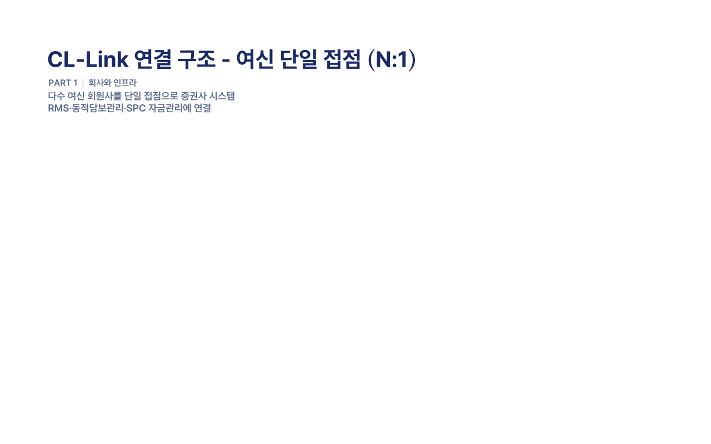{.slide-art-text}

<div class="diagram-stage">

```{=html}
<svg class="cll-svg" viewBox="0 0 1280 600" xmlns="http://www.w3.org/2000/svg" role="img" aria-label="Octopus N:1 연결 구조도">
    <style>
      .cll-box{fill:#fff;stroke:#D8E0F0;stroke-width:1.5;filter:url(#cll-shadow)}
      .cll-accent{fill:#375BD2;filter:url(#cll-shadow)}
      .cll-container{fill:none;stroke:#B9C4DE;stroke-width:1.5;stroke-dasharray:6 7}
      .cll-clabel{fill:#5B6B8C;font-size:14px;font-weight:600;letter-spacing:1px}
      .cll-title{fill:#16223D;font-size:18px;font-weight:700}
      .cll-sub{fill:#5B6B8C;font-size:12px;font-weight:400}
      .cll-title-inv{fill:#fff;font-size:18px;font-weight:700}
      .cll-sub-inv{fill:#C9D6FF;font-size:12px;font-weight:400}
      .cll-flow{fill:none;stroke:#375BD2;stroke-width:2.8;stroke-linecap:round;stroke-dasharray:0 100}
      .cll-tip{fill:#375BD2;opacity:0}
      .cll-f0{animation:cll-g0 6.0s linear infinite}.cll-pt0{animation:cll-t0 6.0s linear infinite}.cll-f1{animation:cll-g1 6.0s linear infinite}.cll-pt1{animation:cll-t1 6.0s linear infinite}.cll-f2{animation:cll-g2 6.0s linear infinite}.cll-pt2{animation:cll-t2 6.0s linear infinite}.cll-f3{animation:cll-g3 6.0s linear infinite}.cll-pt3{animation:cll-t3 6.0s linear infinite}.cll-f4{animation:cll-g4 6.0s linear infinite}.cll-pt4{animation:cll-t4 6.0s linear infinite}.cll-f5{animation:cll-g5 6.0s linear infinite}.cll-pt5{animation:cll-t5 6.0s linear infinite}.cll-f6{animation:cll-g6 6.0s linear infinite}.cll-pt6{animation:cll-t6 6.0s linear infinite}
      @keyframes cll-g0{0%{stroke-dasharray:0 100;opacity:1}9.17%{stroke-dasharray:100 100;opacity:1}86.67%{stroke-dasharray:100 100;opacity:1}98.33%{stroke-dasharray:100 100;opacity:0}100%{stroke-dasharray:100 100;opacity:0}}@keyframes cll-t0{0%{opacity:0}8.67%{opacity:0}9.17%{opacity:1}86.67%{opacity:1}98.33%{opacity:0}100%{opacity:0}}@keyframes cll-g1{0%{stroke-dasharray:0 100;opacity:1}7.50%{stroke-dasharray:0 100;opacity:1}16.67%{stroke-dasharray:100 100;opacity:1}86.67%{stroke-dasharray:100 100;opacity:1}98.33%{stroke-dasharray:100 100;opacity:0}100%{stroke-dasharray:100 100;opacity:0}}@keyframes cll-t1{0%{opacity:0}16.17%{opacity:0}16.67%{opacity:1}86.67%{opacity:1}98.33%{opacity:0}100%{opacity:0}}@keyframes cll-g2{0%{stroke-dasharray:0 100;opacity:1}15.00%{stroke-dasharray:0 100;opacity:1}24.17%{stroke-dasharray:100 100;opacity:1}86.67%{stroke-dasharray:100 100;opacity:1}98.33%{stroke-dasharray:100 100;opacity:0}100%{stroke-dasharray:100 100;opacity:0}}@keyframes cll-t2{0%{opacity:0}23.67%{opacity:0}24.17%{opacity:1}86.67%{opacity:1}98.33%{opacity:0}100%{opacity:0}}@keyframes cll-g3{0%{stroke-dasharray:0 100;opacity:1}22.50%{stroke-dasharray:0 100;opacity:1}31.67%{stroke-dasharray:100 100;opacity:1}86.67%{stroke-dasharray:100 100;opacity:1}98.33%{stroke-dasharray:100 100;opacity:0}100%{stroke-dasharray:100 100;opacity:0}}@keyframes cll-t3{0%{opacity:0}31.17%{opacity:0}31.67%{opacity:1}86.67%{opacity:1}98.33%{opacity:0}100%{opacity:0}}@keyframes cll-g4{0%{stroke-dasharray:0 100;opacity:1}30.00%{stroke-dasharray:0 100;opacity:1}39.17%{stroke-dasharray:100 100;opacity:1}86.67%{stroke-dasharray:100 100;opacity:1}98.33%{stroke-dasharray:100 100;opacity:0}100%{stroke-dasharray:100 100;opacity:0}}@keyframes cll-t4{0%{opacity:0}38.67%{opacity:0}39.17%{opacity:1}86.67%{opacity:1}98.33%{opacity:0}100%{opacity:0}}@keyframes cll-g5{0%{stroke-dasharray:0 100;opacity:1}37.50%{stroke-dasharray:0 100;opacity:1}46.67%{stroke-dasharray:100 100;opacity:1}86.67%{stroke-dasharray:100 100;opacity:1}98.33%{stroke-dasharray:100 100;opacity:0}100%{stroke-dasharray:100 100;opacity:0}}@keyframes cll-t5{0%{opacity:0}46.17%{opacity:0}46.67%{opacity:1}86.67%{opacity:1}98.33%{opacity:0}100%{opacity:0}}@keyframes cll-g6{0%{stroke-dasharray:0 100;opacity:1}45.00%{stroke-dasharray:0 100;opacity:1}54.17%{stroke-dasharray:100 100;opacity:1}86.67%{stroke-dasharray:100 100;opacity:1}98.33%{stroke-dasharray:100 100;opacity:0}100%{stroke-dasharray:100 100;opacity:0}}@keyframes cll-t6{0%{opacity:0}53.67%{opacity:0}54.17%{opacity:1}86.67%{opacity:1}98.33%{opacity:0}100%{opacity:0}}
      @media print{.cll-flow,.cll-tip{opacity:1;stroke-dasharray:none;animation:none}}
      .cll-svg text{dominant-baseline:middle;text-anchor:middle}
    </style>
    <defs>
      <filter id="cll-shadow" x="-20%" y="-20%" width="140%" height="140%">
        <feDropShadow dx="0" dy="2" stdDev="3" flood-color="#16223D" flood-opacity="0.10"/>
      </filter>
    </defs>

    <rect class="cll-container" x="185" y="135" width="715" height="330" rx="18"/>
    <text class="cll-clabel" x="252" y="160">CL-Link</text>

    <path class="cll-flow cll-f0" pathLength="100" d="M156,300 L203,300"/>
    <path class="cll-flow cll-f1" pathLength="100" d="M335,300 L377,300"/>
    <path class="cll-flow cll-f2" pathLength="100" d="M527,300 L569,300"/>
    <path class="cll-flow cll-f3" pathLength="100" d="M719,300 L761,300"/>
    <path class="cll-flow cll-f4" pathLength="100" d="M893,300 L1068,205"/>
    <path class="cll-flow cll-f5" pathLength="100" d="M893,300 L1068,300"/>
    <path class="cll-flow cll-f6" pathLength="100" d="M893,300 L1068,395"/>

    <path class="cll-tip cll-pt0" d="M0,0 L-9,-4.5 L-9,4.5 Z" transform="translate(203,300)"/>
    <path class="cll-tip cll-pt1" d="M0,0 L-9,-4.5 L-9,4.5 Z" transform="translate(377,300)"/>
    <path class="cll-tip cll-pt2" d="M0,0 L-9,-4.5 L-9,4.5 Z" transform="translate(569,300)"/>
    <path class="cll-tip cll-pt3" d="M0,0 L-9,-4.5 L-9,4.5 Z" transform="translate(761,300)"/>
    <path class="cll-tip cll-pt4" d="M0,0 L-9,-4.5 L-9,4.5 Z" transform="translate(1068,205) rotate(-28.5)"/>
    <path class="cll-tip cll-pt5" d="M0,0 L-9,-4.5 L-9,4.5 Z" transform="translate(1068,300)"/>
    <path class="cll-tip cll-pt6" d="M0,0 L-9,-4.5 L-9,4.5 Z" transform="translate(1068,395) rotate(28.5)"/>

    <rect class="cll-box" x="34" y="254" width="120" height="92" rx="12"/>
    <text class="cll-title" x="94" y="300">증권사</text>

    <rect class="cll-box" x="205" y="254" width="128" height="92" rx="12"/>
    <text class="cll-title" x="269" y="292">RMS</text>
    <text class="cll-sub" x="269" y="314">증권사 내부</text>

    <rect class="cll-box" x="379" y="254" width="146" height="92" rx="12"/>
    <text class="cll-title" x="452" y="292">동적담보관리</text>
    <text class="cll-sub" x="452" y="314">종목·계좌관리</text>

    <rect class="cll-box" x="571" y="254" width="146" height="92" rx="12"/>
    <text class="cll-title" x="644" y="292">SPC 자금관리</text>
    <text class="cll-sub" x="644" y="314">SPC 자금흐름</text>

    <rect class="cll-accent" x="763" y="244" width="128" height="112" rx="12"/>
    <text class="cll-title-inv" x="827" y="292">Octopus</text>
    <text class="cll-sub-inv" x="827" y="315">통신중계버스</text>

    <rect class="cll-box" x="1070" y="169" width="170" height="72" rx="12"/>
    <text class="cll-title" x="1155" y="205">여신기관 1</text>
    <rect class="cll-box" x="1070" y="264" width="170" height="72" rx="12"/>
    <text class="cll-title" x="1155" y="300">여신기관 2</text>
    <rect class="cll-box" x="1070" y="359" width="170" height="72" rx="12"/>
    <text class="cll-title" x="1155" y="395">여신기관 N</text>
  </svg>
```

</div>

<div class="confidential">㈜솔라리스오피둠 · STRICTLY PRIVATE &amp; CONFIDENTIAL</div>

---

## &nbsp; {.svg-slide data-menu-title="운영 인력"}

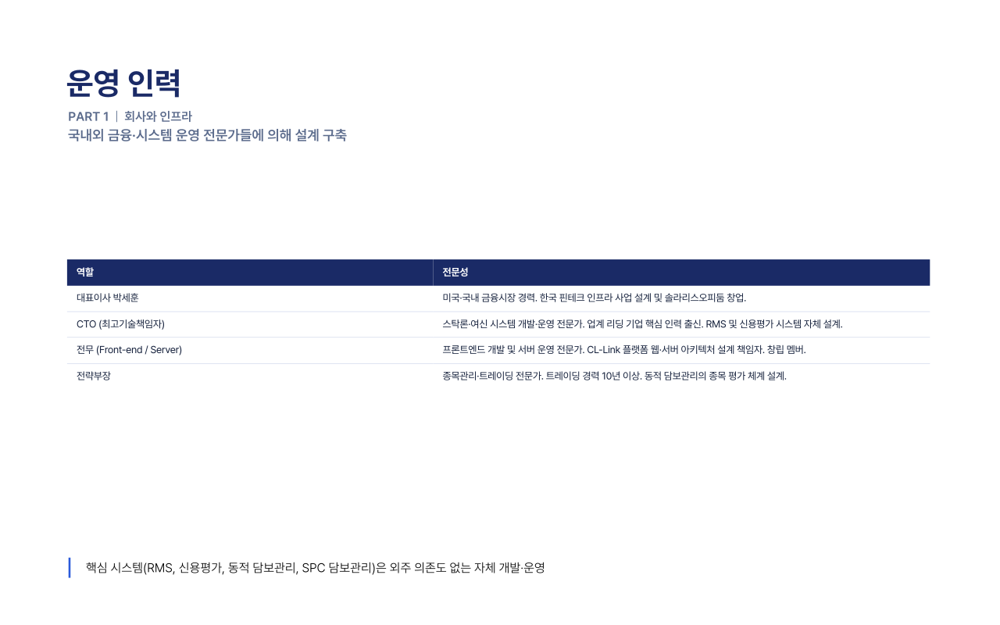{.slide-art}

<div class="confidential">㈜솔라리스오피둠 · STRICTLY PRIVATE &amp; CONFIDENTIAL</div>

---

## &nbsp; {.svg-slide data-menu-title="자금 구조"}

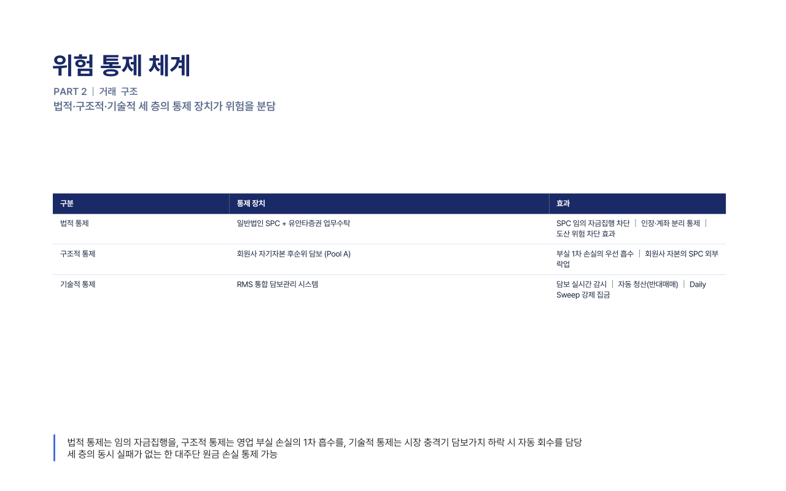{.slide-art}

<div class="confidential">㈜솔라리스오피둠 · STRICTLY PRIVATE &amp; CONFIDENTIAL</div>

---

## 위험 통제 체계 {data-menu-title="위험 통제"}

<div class="eyebrow">PART II · 거래 구조</div>
<div class="subtitle">법적·구조적·기술적 세 층의 통제 장치가 위험을 분담한다.</div>

| 구분 | 통제 장치 | 효과 |
|------|-----------|------|
| 법적 통제 | 일반법인 SPC + 유안타증권 업무수탁 | SPC 임의 자금집행 차단 │ 인장·계좌 분리 통제 │ 도산 위험 차단 효과 |
| 구조적 통제 | 회원사 자기자본 후순위 담보 (Pool A) | 부실 1차 손실의 우선 흡수 │ 회원사 자본의 SPC 외부 락업 |
| 기술적 통제 | RMS 통합 담보관리 시스템 | 담보 실시간 감시 │ 자동 청산(반대매매) │ Daily Sweep 강제 집금 |

<div class="tagline">법적 통제는 임의 자금집행을, 구조적 통제는 영업 부실 손실의 1차 흡수를, 기술적 통제는 시장 충격기 담보가치 하락 시 자동 회수를 담당한다. 세 층의 동시 실패가 없는 한 대주단 원금 손실 가능성은 통제된다.</div>

<div class="confidential">㈜솔라리스오피둠 · STRICTLY PRIVATE &amp; CONFIDENTIAL</div>

---

## &nbsp; {.svg-slide data-menu-title="Waterfall"}

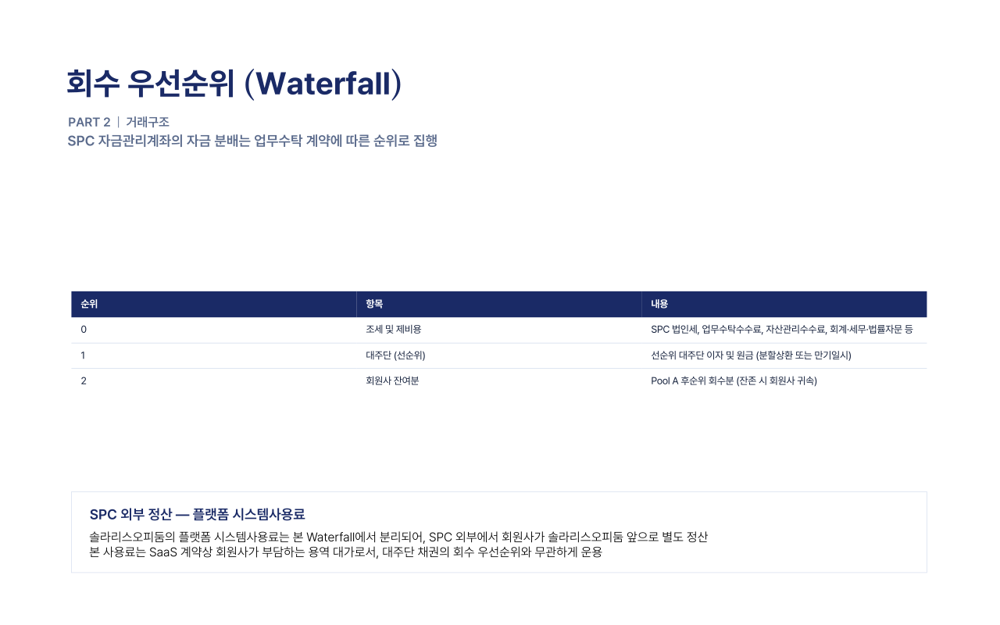{.slide-art}

<div class="confidential">㈜솔라리스오피둠 · STRICTLY PRIVATE &amp; CONFIDENTIAL</div>

---

## &nbsp; {.svg-slide data-menu-title="시연 안내"}

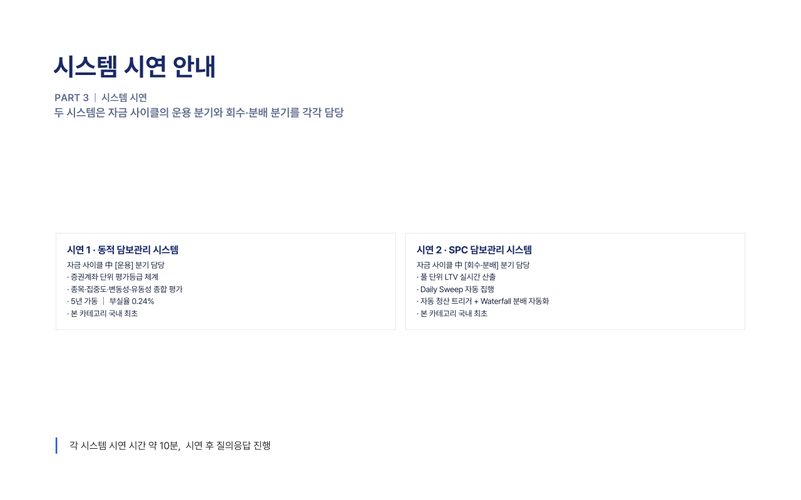{.slide-art}

<div class="confidential">㈜솔라리스오피둠 · STRICTLY PRIVATE &amp; CONFIDENTIAL</div>

---

## &nbsp; {.svg-slide data-menu-title="시연 1 동적담보관리"}

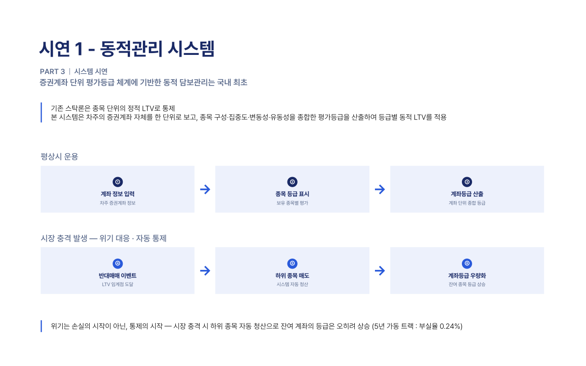{.slide-art}

<div class="confidential">㈜솔라리스오피둠 · STRICTLY PRIVATE &amp; CONFIDENTIAL</div>

---

## &nbsp; {.svg-slide data-menu-title="시연 2 SPC담보관리"}

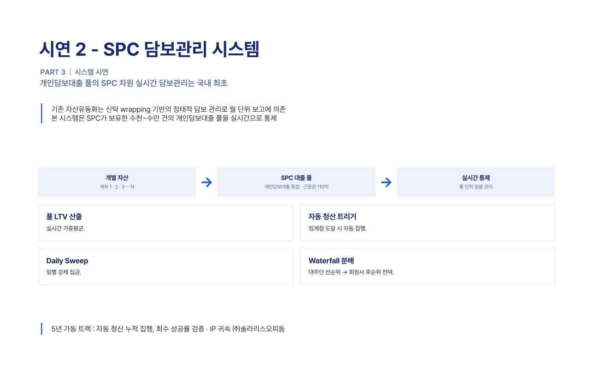{.slide-art}

<div class="confidential">㈜솔라리스오피둠 · STRICTLY PRIVATE &amp; CONFIDENTIAL</div>

---

## &nbsp; {.svg-slide data-menu-title="Term Sheet"}

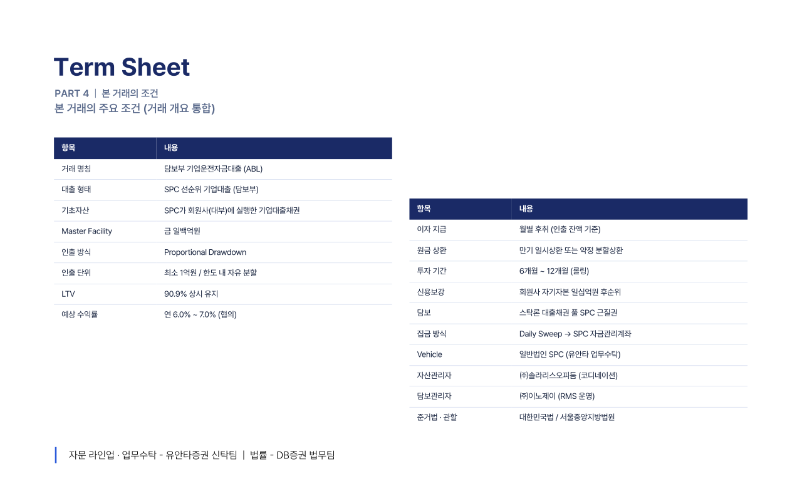{.slide-art}

<div class="confidential">㈜솔라리스오피둠 · STRICTLY PRIVATE &amp; CONFIDENTIAL</div>

---

## &nbsp; {.svg-slide data-menu-title="인프라 참여자"}

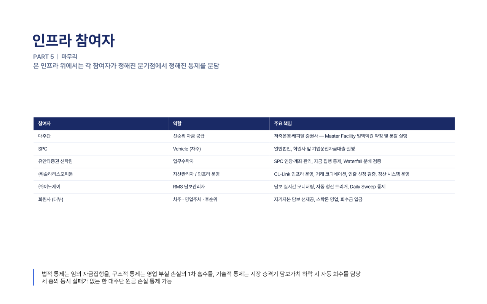{.slide-art}

<div class="confidential">㈜솔라리스오피둠 · STRICTLY PRIVATE &amp; CONFIDENTIAL</div>

---

## &nbsp; {.svg-slide data-menu-title="인프라 위치"}

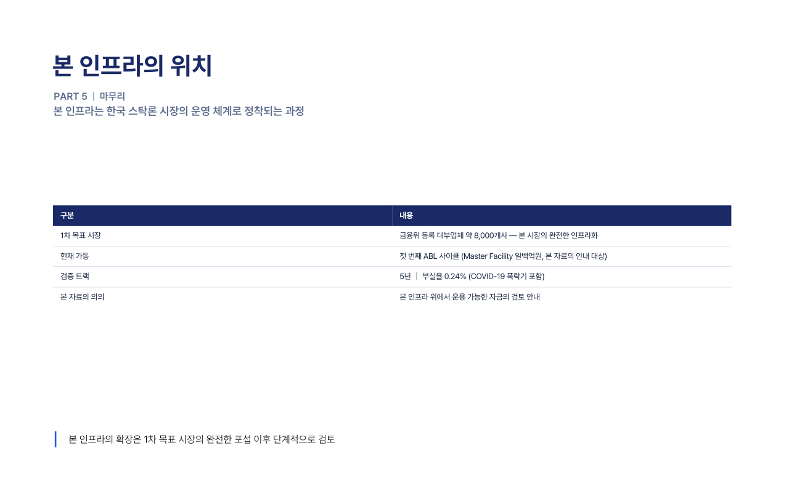{.slide-art}

<div class="confidential">㈜솔라리스오피둠 · STRICTLY PRIVATE &amp; CONFIDENTIAL</div>

---

## &nbsp; {.svg-slide data-menu-title="APPENDIX 면책"}

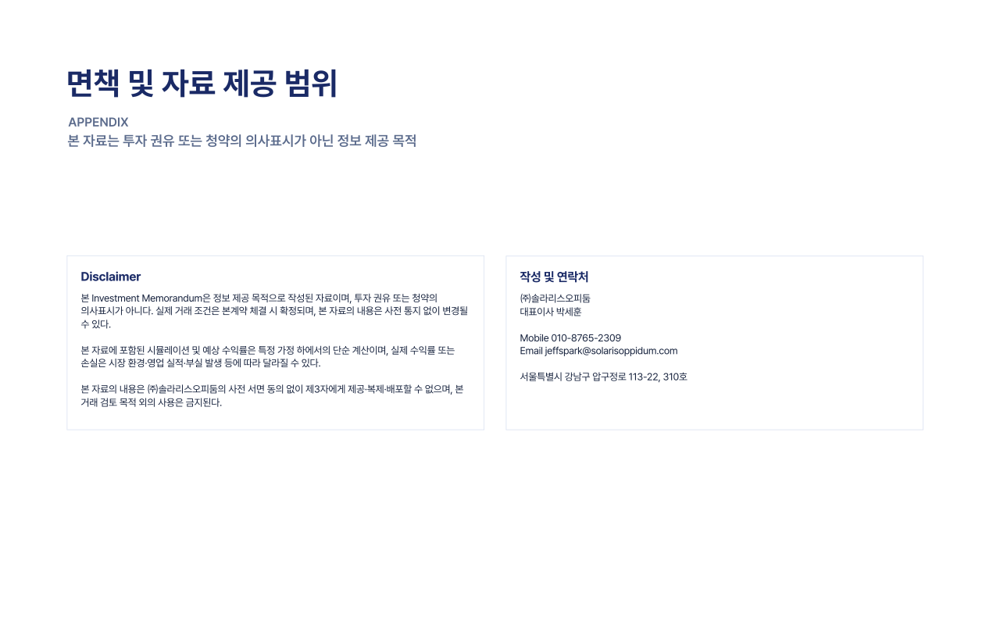{.slide-art}

<div class="confidential">㈜솔라리스오피둠 · STRICTLY PRIVATE &amp; CONFIDENTIAL</div>
